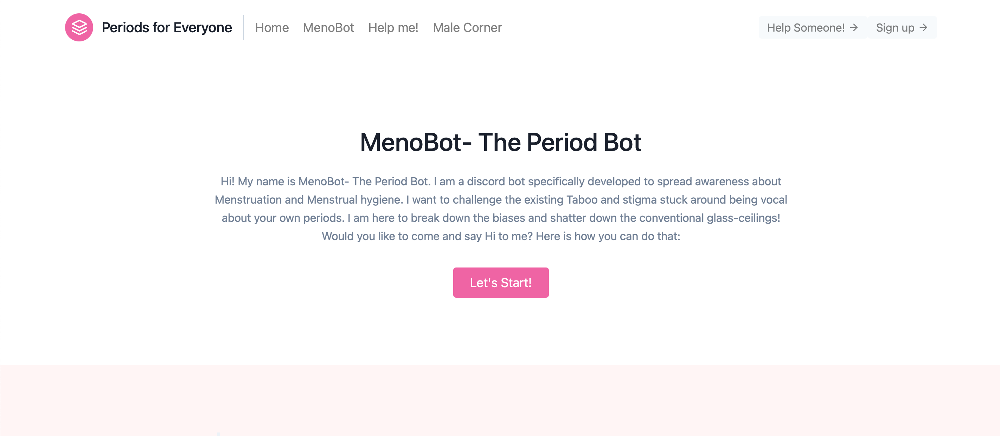

# PeriodsForEveryone

- Periods for Everyone is an inclusive web page product which extend it's viabilities for everyone out there, be it a man, be it a woman; this product offers something for everyone. The problem it sticks around is how we can break down the existing biases and stigma around Menstruation by creating a self-sustainable one stop all eco-system. It serves the purpose of being relatable and easily accessible for the user case scenario.

- You can check out the project here: [PeriodsForEveryone](https://khushisharma22.github.io/PeriodsForEveryone/)

  
 

- Features
 

  
 

 
 - Male Corner
 

  
 

 
 - MenoBot
 

  
 

- Technologies used: HTML, CSS, JavaScript, Tailwind CSS

